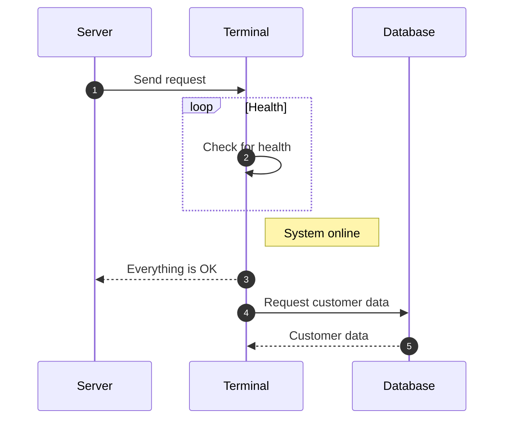

# Diagram Examples

## Flowcharts

```mermaid
---
config:
  layout: dagre
---
classDiagram
direction TB
    class EventData {
	    +~EventData()
    }
    class WidthCheck {
	    +float maxWidth
	    +float minWidth
    }
    class ActionEventTracker {
	    +ActionEventTracker()
	    +bool shouldTriggerEvent()
	    +void triggerEvent()
	    +void setCooldown(unsigned long long cooldownMillis)
    }
    class ActionEventManager {
	    +void addEvent(EventType event)
	    +bool shouldTriggerEvent(EventType event)
	    +void triggerEvent(EventType event)
	    +void setEventData(EventType event, std::shared_ptr data)
    }
    class EventType {
	    IMAGE_SAVER_HEALTH_CHECK
	    SYSTEM_RUNNING_IN_FAULT
	    ROLL_START_BUTTON
	    UNKNOWN
    }
    class EventTypeUtils {
	    +static EventType getEventTypeForErrorCode(std::string error_code)
    }
    class BaseType {
	    +virtual json toJSON() = 0
	    +virtual bool loadJSON(json type) = 0
    }
    class Job {
    }
    class Roll {
    }
    class RollWidth {
    }
    class Speed {
    }
    class Defect {
    }
    class CameraConfig {
    }
    class GroupConfig {
    }
    class CameraManager {
	    +CameraParams getCameraParams()
	    +WidthParams getWidthParams()
	    +bool initCamera()
    }
    class CameraNode {
	    +void startLooping()
	    +void processAndPublishImage()
    }
    class CameraParams {
    }
    class WidthParams {
    }
    class GrabedImage {
    }
    class CameraHighSpeedSimulator {
    }
    class DefectsProcessor {
    }
    class Annotation {
    }
    class PointXY {
    }
    class RobroCameraAbstractClass {
    }
    class Recipe {
	    +Camera camera
	    +NN nn
    }
    class Camera {
    }
    class NN {
    }
    class Group {
    }
    class Yolov8 {
    }
    class PLCCommunication {
	    +bool initPLC()
	    +uint64_t getRunningMeterMM()
    }
    class BuzzerControl {
	    +void turnOn(int durationMs)
	    +void turnOff()
	    +void beep(int count)
    }
    class RobroModbusLib {
    }
    class MySQLClient {
	    + static MySQLClient& getInstance()
	    + int64_t add_state_log(...)
    }
    class MySQLDataManager {
	    +void setupRollsLog()
	    +void logRollData(...)
	    +void logDefectData(...)
    }
    class ReportingNode {
	    +void rollDataCallback(String msg)
	    +void defectDataCallback(String msg)
    }
    class SystemStateTracker {
	    +bool changeState(string new_state)
	    +string getCurrentState()
    }
    class ComponentStateTrackerLogger {
	    +bool changeState(ComponentState new_state)
	    +string getCurrentState()
    }
    class SystemState {
    }
    class WeavingInspection {
	    +void clearDetections()
	    +bool isDetectionsAvailable()
	    +void addSystemLog(string severity, string msg, string code)
    }
    class SpeedCalculator {
	    +void addPosition(double currentPosition)
	    +double calculateSpeed()
	    +void reset()
    }
    class LogUtils {
	    +static LogCode getLogCodeFromString(string codeStr)
	    +static LogSeverity getLogSeverityFromString(string severityStr)
    }
    class LogCode {
    }
    class LogSeverity {
    }
    class LogComponent {
    }
    class ComponentState {
    }

	<<abstract>> EventData
	<<singleton>> MySQLClient

    EventData <|-- WidthCheck
    ActionEventManager --> ActionEventTracker
    ActionEventManager --> EventData
    ActionEventManager --> EventType
    EventTypeUtils --> EventType
    BaseType <|-- Job
    BaseType <|-- Roll
    BaseType <|-- RollWidth
    BaseType <|-- Speed
    BaseType <|-- Defect
    BaseType <|-- CameraConfig
    BaseType <|-- GroupConfig
    GroupConfig --> CameraConfig : manages (via IDs)
    CameraHighSpeedSimulator --> RobroCameraAbstractClass : uses
    CameraManager --> CameraParams
    CameraManager --> WidthParams
    CameraNode --> CameraManager
    CameraNode --> CameraParams
    CameraNode --> WidthParams
    CameraNode --> GrabedImage
    CameraNode --> DefectsProcessor
    Annotation --> PointXY
    DefectsProcessor --> Annotation
    NN --> Group
    NN --> Yolov8
    Recipe --> Camera
    Recipe --> NN
    PLCCommunication --> RobroModbusLib : uses
    PLCCommunication --> MySQLClient : logs via
    ReportingNode --> MySQLDataManager
    ReportingNode --> Roll
    ReportingNode --> Defect
    ReportingNode --> Job
    ReportingNode --> RollWidth
    ReportingNode --> Speed
    SystemStateTracker --> SystemState
    ComponentStateTrackerLogger --> MySQLClient
    WeavingInspection --> Recipe
    WeavingInspection --> ActionEventManager
    WeavingInspection --> PLCCommunication
    WeavingInspection --> BuzzerControl
    WeavingInspection --> RollWidth
    WeavingInspection --> SpeedCalculator
    WeavingInspection --> MySQLClient
    WeavingInspection --> Roll
    WeavingInspection --> Job
    WeavingInspection --> Speed
    WeavingInspection --> ComponentStateTrackerLogger
    LogUtils --> LogCode
    LogUtils --> LogSeverity
    LogUtils --> LogComponent
    LogUtils --> ComponentState

	style CameraNode fill:#f0fff4,stroke:#228b22,stroke-width:2px

	style ReportingNode fill:#fff5e6,stroke:#ff8c00,stroke-width:2px

	style WeavingInspection fill:#e6f7ff,stroke:#0366d6,stroke-width:2px
```

## Sequence Diagrams

```mermaid
sequenceDiagram
  autonumber
  Server->>Terminal: Send request
  loop Health
      Terminal->>Terminal: Check for health
  end
  Note right of Terminal: System online
  Terminal-->>Server: Everything is OK
  Terminal->>Database: Request customer data
  Database-->>Terminal: Customer data
```